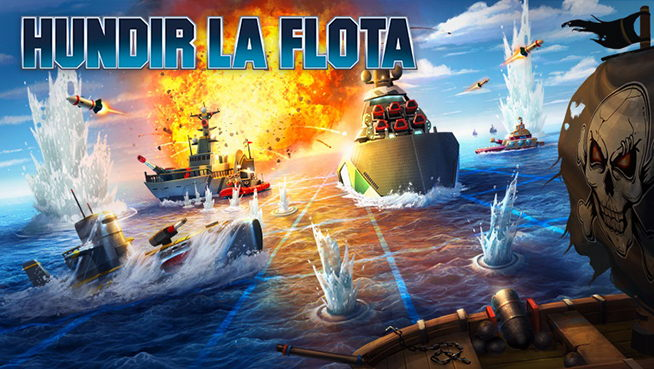

## BATTLESHIP

# Autores:
    -Rafael Manzano Pérez
    -Gonzalo Pérez Díez

# Proyecto:

Este trabajo consistía en recrear el juego de **hundir la flota** en Python.

# Reglas del juego:

    1. Se juega contra la máquina
    2. Los tablero son de 10x10 sin ninguna referencia para los disparos.
    3. Para disparar a un punto hay que tener en cuenta que se empieza a contar en 0.
    4. Los barcos de la máquina y los tuyos se colocarán aleatoriamente, por lo que lo único que
       tienes que hacer es iniciar y disfrutar.
    5. Los barcos disponibles son:
        - 1 barco de 4 de eslora.
        - 2 barcos de 3 de eslora.
        - 3 barcos de 2 de eslora.
        - 4 barcos de 1 de eslora.
    6. El objetivo del juego es hundir todos los barcos enemigos.
    7. Al iniciar la partida empiezas disparando tu.
    8. Si alcanzas algún barco continuas "disparando" hasta fallar.
    9. Si fallas le toca a la máquina "disparar".